# 🎵 SoniqStem AI
**Advanced Neural Audio Processing & Vocal Transformation**


> *Unlock the hidden layers of your music. Separate stems with surgical precision and transform voices with the power of DSP.*

---

## 🌟 Why SoniqStem?

SoniqStem AI is not just another audio tool. It's a localized powerhouse for music producers, DJs, and content creators. We leverage state-of-the-art AI models to deconstruct audio and reconstruct distinct sonic elements.

### 🔥 Features

#### 1. 🧬 Ultimate Stem Separator
*Powered by Meta's Demucs v4 Hybrid Transformer*
Stop struggling with EQ. Extract studio-quality stems from any mixed track in seconds.
- **Micro-Surgical Precision:** Cleanly isolates **Vocals** from the **Instrumental**.
- **Dual Engine:** Supports local file uploads (WAV/MP3/FLAC) and direct YouTube URL processing.
- **High Fidelity:** Outputs pure 24-bit WAV for maximum localized quality.

#### 2. 🧪 Voice Lab Lite
*DSP-Based Vocal Shapeshifter*
Transform the timbre and gender of any vocal track instantly without quality loss.
- **Gender Swapping:** Morph Male vocals to Female (and vice-versa) with formant-preserving pitch shifting.
- **Zero Latency DSP:** Uses `Librosa` for artifact-free signal processing.
- **Safe & Fast:** Runs 100% locally on your machine. No cloud uploads, no privacy risks.

---

## 🛠️ Architecture & Tech Stack

How does the magic happen? Here is the flow of data through our neural engine:

```mermaid
graph TD
    User([👤 User]) -->|Uploads Audio/URL| Frontend
    
    subgraph "🚀 Frontend (React + Vite)"
        Frontend[UI Dashboard]
        Waveform[Waveform Visualizer]
    end
    
    Frontend -->|API Request| Backend
    
    subgraph "🧠 Backend (FastAPI + Python)"
        Backend[API Server]
        Router{Request Type}
        Backend --> Router
        
        Router -->|Split Stems| Separator[Demucs AI Engine]
        Router -->|Voice Clone| VoiceLab[Librosa DSP Engine]
        
        separator_model[(Demucs v4 Model)] -.-> Separator
    end
    
    Separator -->|Vocals + Instr| Storage[Local Storage]
    VoiceLab -->|Modified Audio| Storage
    
    Storage -->|Static File Serving| Frontend
```



### Core Technologies
- **Frontend:** React 18, TailwindCSS (Glassmorphism UI), Lucide Icons.
- **Backend:** FastAPI (High-performance Async), Uvicorn.
- **AI/DSP:**
    - **Demucs:** State-of-the-art music source separation.
    - **Librosa:** Professional audio analysis and manipulation.
    - **PyTorch:** Deep learning framework.

---

## 🚀 Getting Started

### Prerequisites
- Python 3.10+
- Node.js & npm
- FFmpeg (Must be in system PATH)

### Installation

1. **Clone the Repo**
   ```bash
   git clone https://github.com/graviton711/SoniqStem.git
   cd SoniqStem
   ```

2. **Backend Setup**
   ```bash
   pip install -r requirements.txt
   # Start the API Server (Port 8001)
   python api.py
   ```

3. **Frontend Setup**
   ```bash
   cd soniqstem-ai
   npm install
   # Start the UI (Port 5173)
   npm run dev
   ```

4. **Launch**
   Open `http://localhost:5173` and start creating!

---

## 📜 License
MIT License © 2025 SoniqStem AI
